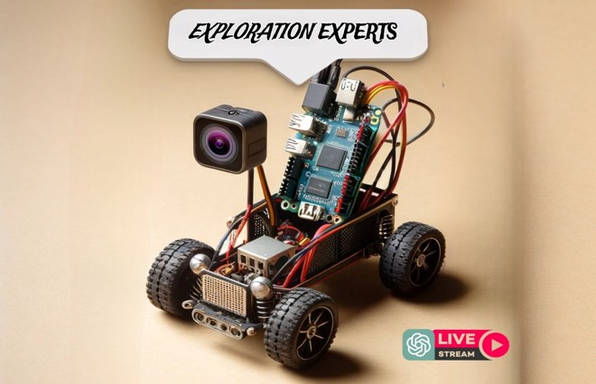
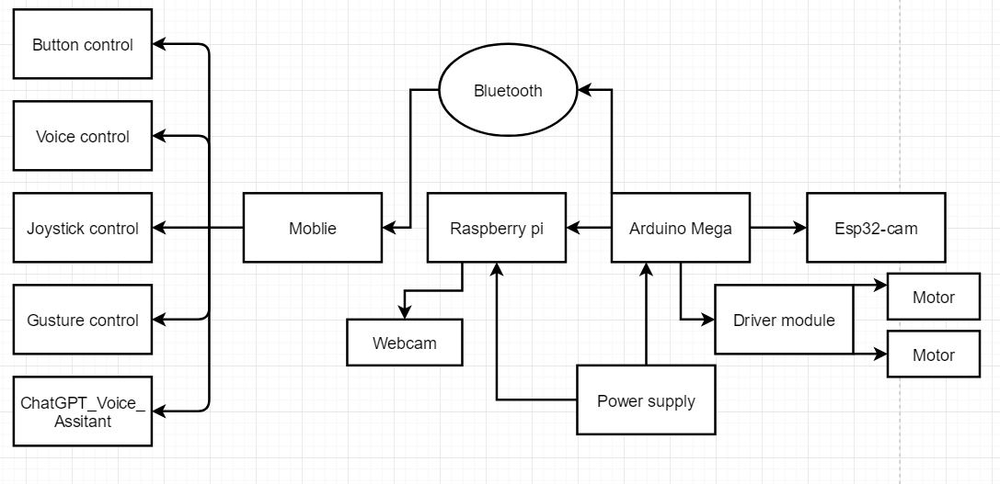
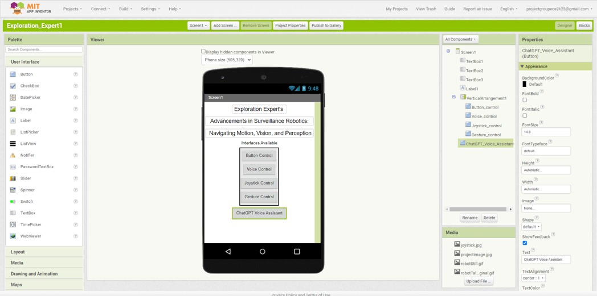
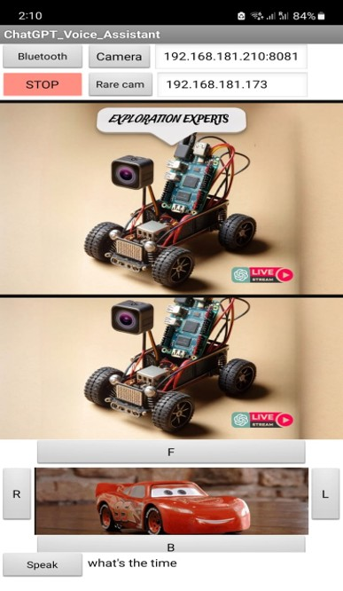

# 🤖 Surveillance Robot: Advancements in Surveillance Robotics

Welcome to the **Surveillance Robot** project! This repository showcases cutting-edge advancements in robotics, focusing on **motion**, **vision**, and **perception** for surveillance purposes. Combining technologies like Arduino, Raspberry Pi, ESP32-CAM, Bluetooth, and MIT App Inventor, this robot is designed for real-time monitoring with interactive features such as ChatGPT-powered voice control.

---

## Table of Contents

1. [Introduction](#introduction)
2. [Project Overview](#project-overview)
3. [Architecture](#architecture)
4. [Interface Design](#interface-design)
   - [Button Control](#button-control)
   - [Voice Control](#voice-control)
   - [Joystick Control](#joystick-control)
   - [Gesture Control](#gesture-control)
5. [Vision Integration](#vision-integration)
   - [Front Camera](#front-camera)
   - [Rear Camera](#rear-camera)
6. [ChatGPT Integration](#chatgpt-integration)
7. [Hybridization](#hybridization)
8. [Results](#results)
9. [Future Work](#future-work)
10. [Acknowledgements](#acknowledgements)

---

## Introduction

This project demonstrates a **user-centric robotic surveillance system** that integrates:
- **Motion**: Various control methods including button, voice, joystick, and gesture.
- **Vision**: Front and rear cameras for real-time video streaming.
- **Perception**: ChatGPT-powered natural language interaction for enhanced user experience.

Key features include:
- **Real-time monitoring** with live video transmission.
- **Intuitive control methods** to adapt to diverse environments.
- **AI-powered voice assistant** for interactive and user-friendly operation.

---

## Project Overview

This system combines **mechanical control, cognitive interaction**, and **vision processing**, making it a robust platform for:
- Security surveillance.
- Educational applications.
- Interactive robotics.

The **MIT App Inventor** was used to design a mobile application for seamless robot control. It supports live video streaming, voice commands, and multiple control modes.

---

## Architecture

The system architecture integrates:
1. **Arduino Mega**: Central controller for all commands.
2. **Raspberry Pi**: Processes data from the front camera.
3. **ESP32-CAM**: Streams data from the rear camera.
4. **Bluetooth Communication**: Ensures seamless control.
5. **Driver Module**: Operates motors with precision.

---

## Interface Design

### Button Control

- Five buttons for basic operations: **Forward**, **Backward**, **Left**, **Right**, and **Stop**.
- Ideal for **precise and quick commands**.

### Voice Control
- Enables hands-free operation using **voice commands** like "Forward" or "Stop."
- Accessible and intuitive for all users.

### Joystick Control
- Offers a **gaming-style experience** for vehicle navigation.
- Provides fine-grained control over robot movement.

### Gesture Control
- Users can control the robot by **tilting or rotating their mobile device**.
- Immersive and interactive, ideal for educational purposes.

---

## 📹 Vision Integration

### Front Camera

- Mounted on Raspberry Pi for **real-time video processing**.
- Captures high-resolution visuals of the surroundings.

### Rear Camera
- Powered by ESP32-CAM for seamless **wireless video transmission**.
- Ensures full situational awareness during reverse operations.

---

## ChatGPT Integration

- **ChatGPT-powered voice assistant** provides conversational interaction.
- Users can give commands, ask for updates, or query the system in natural language.
- Enhanced accessibility and user engagement through AI-driven communication.

---

## Hybridization

All control methods, vision systems, and ChatGPT integration are unified into a single robust system:
- Live video transmission from both cameras.
- Dynamic user interaction with AI-driven capabilities.
- Intuitive mobile application for seamless operation.

---

## Results

The system was tested extensively, yielding the following insights:
- **Button Control**: High precision and responsiveness.
- **Voice Control**: Convenient for hands-free operation.
- **Joystick Control**: Smooth and user-friendly.
- **Gesture Control**: Immersive but requires refinement for complex environments.
- **Video Transmission**: Reliable and high clarity, even under varying network conditions.

---

## Future Work

- **Improved Gesture Recognition**: Enhance accuracy for diverse environments.
- **Advanced Vision Systems**: Integrate LiDAR for better obstacle detection.
- **Extended Communication**: Incorporate GPS and IoT for broader control and monitoring.

---

## Acknowledgements

This project would not have been possible without:
- [MIT App Inventor](https://appinventor.mit.edu/) for its versatile application development platform.
- The contributors of Raspberry Pi and ESP32-CAM for their robust vision capabilities.

---

👋 **Thank you for exploring this repository!**
